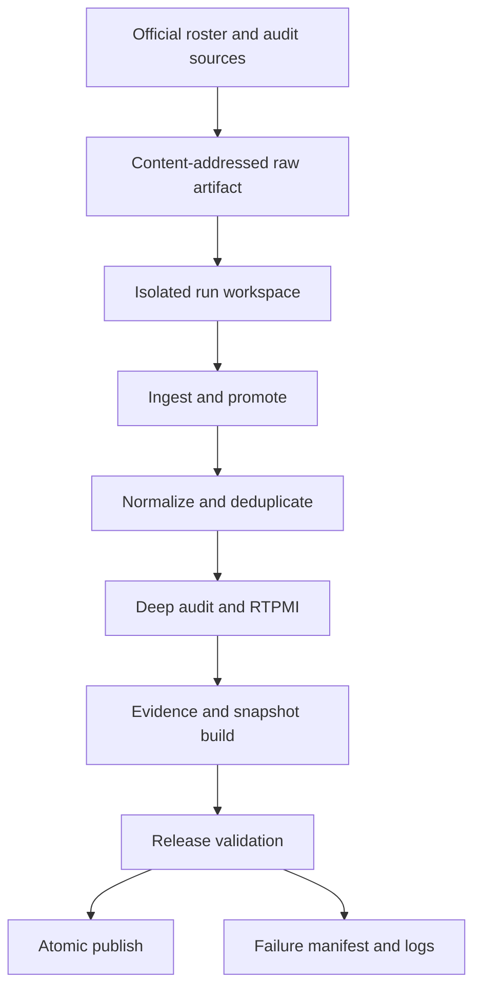

# Production data pipeline

## Current-state analysis

The repository originally generated a release through one shell chain in
`prepare:data`: thirteen Node.js scripts read and rewrote files directly under
`data/` and `public/datasets/`. The domain logic is valuable and remains the
compatibility implementation, but the execution model had these operational
risks:

- source, intermediate and published files shared the same mutable tree;
- a failed late stage could leave a partially rebuilt release;
- raw inputs were not captured under a content-addressed run identity;
- stage contracts existed only as implicit file reads/writes;
- dates and versions were duplicated as constants in several scripts;
- the only retry/checkpoint behavior lived inside the crawler;
- no run manifest connected source hashes, code/config version and outputs;
- packet generation deleted current directories before completing replacement;
- the workflow committed generated files directly after the command chain.

The Python package does not rewrite the RTPMI and evidence business rules. It
wraps those tested Node.js transforms in an isolated, reproducible execution
boundary and makes each migration of business logic to Python optional.

## Architecture



The orchestration layer is single-node Python 3.11+ and standard-library only.
Transformations remain Node 22 processes. Distributed Spark is unnecessary for
the current volume (115 universities and tens of thousands of evidence links).
Acquisition/crawling stays separate because it is network-bound, checkpointed
and retried differently from deterministic transformations.

Artifact storage is configurable with `PIPELINE_ARTIFACT_ROOT`. On a production
self-hosted runner this must point to durable attached storage, not an ephemeral
checkout. Sync that root to versioned object storage using infrastructure-owned
credentials; the pipeline package does not embed storage secrets.

## Stages and contracts

| Stage | Inputs | Outputs | Contract |
| --- | --- | --- | --- |
| Raw capture | locked ISC roster, audit sources, crawler discovery, two reviewed Markdown reports, initial catalogs | `raw/<sha256>/...`, `RAW-MANIFEST.json` | all declared sources exist; byte hashes recorded before mutation |
| University source ingestion | 115-row roster and audit reports | research review, portal/document re-audit, portal audit, document catalog | exactly 115 rows; report order must match locked roster; only HTTP(S) sources |
| Discovery promotion | crawler evidence/documents and current catalogs | promoted audits, reviews, units, systems, documents | only confidence-gated discoveries; unknown slugs rejected by downstream validation |
| Normalization/deduplication | promoted catalogs | canonical public catalogs and filter report | canonical URL/text keys; scoped research documents; deterministic first-winner rules |
| Deep audit | roster, audit, unit/system/document catalogs | deep audit matrix | one record per university; complete public dimension set; coverage formula reproducible |
| RTPMI calculation | deep audit and normalized catalogs | ranking and methodology weights | gate, weights, score range and rank ordering; unresolved is never zero |
| Evidence build | normalized records and reviews | provenance ledger and 805 dimension outcomes | unique provenance IDs; 115 × 7 matrix; source counts and URLs valid |
| Snapshot generation | all curated facts | summary, 115 packets, JSON/CSV public datasets | one configured date/version; output paths complete |
| Release validation | complete isolated `data/` and `public/datasets/` | validation report/log | legacy validators plus Python cross-dataset contract checks |
| Atomic publish | validated work tree | project `data/`, `public/datasets/` | replace both trees as one recoverable transaction; backup retained |

Each configured stage declares `inputs`, `outputs`, commands, dependencies,
timeout, determinism and retry policy in `pipeline/config/pipeline.toml`.

## Validation rules

Python release gates add cross-file checks to the existing detailed validators:

- exactly 115 unique university slugs;
- portal audit, deep audit and review cover precisely the locked roster;
- exactly 805 public outcomes, one for every university × seven public dimensions;
- status vocabulary is closed and `sourceCount == len(sources)`;
- public evidence and provenance URLs are HTTP(S);
- provenance IDs and ranking university rows are unique;
- every ranking university belongs to the roster;
- global ranks are contiguous and scores are in `[0, 100]`;
- no stage may succeed without every declared output.

The existing Node validators continue to enforce canonical URL rules, research
document scope, social-link exclusion, CSV parity, dimension calculations and
RTPMI methodology details.

## Idempotency

- Raw input sets are addressed by SHA-256 of a path/hash inventory.
- A stage fingerprint combines input hashes, commands, pipeline package version,
  Snapshot date, schema version and methodology version.
- Deterministic stage outputs are cached by fingerprint and restored on rerun.
- `--force` bypasses stage cache without deleting historical artifacts.
- Every run gets a unique run ID, while identical raw and stage artifacts share
  their content address.
- Publishing is explicit (`run --publish`) and happens only after all validation.
- Snapshot/config dates are injected through environment variables rather than
  silently using the wall clock.

## Failure and retry strategy

- Deterministic transforms are not retried; another attempt cannot fix invalid
  data and would hide defects.
- Network acquisition should be marked non-deterministic and may retry only
  transient exit codes, with capped exponential backoff and jitter at the
  acquisition adapter. The existing crawler checkpoint/resume remains active.
- Every command has a timeout and writes a per-stage combined log.
- A failure writes `FAILURE.json`, preserves raw/work/log artifacts and blocks
  publish. Existing project data remains untouched.
- Process exit is non-zero for configuration, contract, stage or publish errors.
- Recovery starts a new run after correcting the cause; failed artifacts are not
  overwritten.

HTTP retry policy for future acquisition adapters:

- retry: timeout, connection reset, 408, 425, 429 and 5xx;
- respect `Retry-After`, then exponential backoff with jitter;
- do not retry other 4xx or validation failures;
- cap attempts and total elapsed time per university;
- record final URL, status, fetched-at, ETag/Last-Modified, content hash and body
  reference in the raw manifest;
- a network failure means unknown/unresolved, never absence.

## Package layout

```text
pyproject.toml
pipeline/
  config/pipeline.toml
  schema/run-manifest.schema.json
  src/research_portal_pipeline/
    cli.py
    config.py
    contracts.py
    hashing.py
    models.py
    runner.py
  tests/
scripts/
  run-pipeline.mjs
```

Business logic remains in existing `scripts/*.mjs`; orchestration and operational
state are confined to the Python package. Runtime dependencies are zero beyond
Python itself. `setuptools` is only a bounded build dependency; the npm wrapper
runs directly from source and works without installing the Python package.

## Testing strategy

1. Unit tests: canonical hashing, config/DAG validation, URL contracts and safe
   directory replacement.
2. Contract tests: run `pipeline:validate` against checked-in fixtures/current
   release.
3. Integration test: full pipeline in isolated workspace, publish disabled.
4. Golden/parity test: compare all JSON/CSV hashes or normalized semantic output
   to an approved Snapshot.
5. Failure injection: non-zero command, timeout, missing output, invalid URL,
   duplicate slug and interrupted publish rollback.
6. Reproducibility test: run twice with identical input/config/code; all
   deterministic stage fingerprints and final output hashes must match.
7. Production rehearsal: run on a copy of the durable artifact volume before
   changing the scheduled workflow.

## Commands

```bash
npm run pipeline:test
npm run pipeline:plan
npm run pipeline:validate
npm run prepare:data
```

`prepare:data` now runs the isolated pipeline and publishes only after success.
The original chain is retained temporarily as `npm run prepare:data:legacy` for
one release cycle and emergency comparison.

For a no-publish rehearsal:

```bash
node scripts/run-pipeline.mjs run
```

For an uncached rebuild:

```bash
node scripts/run-pipeline.mjs run --publish --force
```

## Reproducibility record

Each run writes `RUN-MANIFEST.json` containing:

- raw artifact hash/path;
- config and code hashes;
- Python, Node, platform and pipeline versions;
- stage commands, fingerprints, attempts, durations and input/output hashes;
- log paths, status, failure details and publish timestamp.

To reproduce a historical release, use the same raw content address, code commit,
configuration hash and environment versions recorded in the manifest. Long-term
retention should keep raw artifacts, run manifests, logs and final snapshots;
temporary workspaces may be expired after a successful retention check.

## Migration/removal policy

Nothing is deleted in this release. Keep `prepare:data:legacy` and all existing
Node transforms until at least two successful scheduled pipeline runs and hash
parity are documented. After that, remove only the legacy npm command—not the
domain transforms—unless each transform has been independently ported and
golden-tested.
